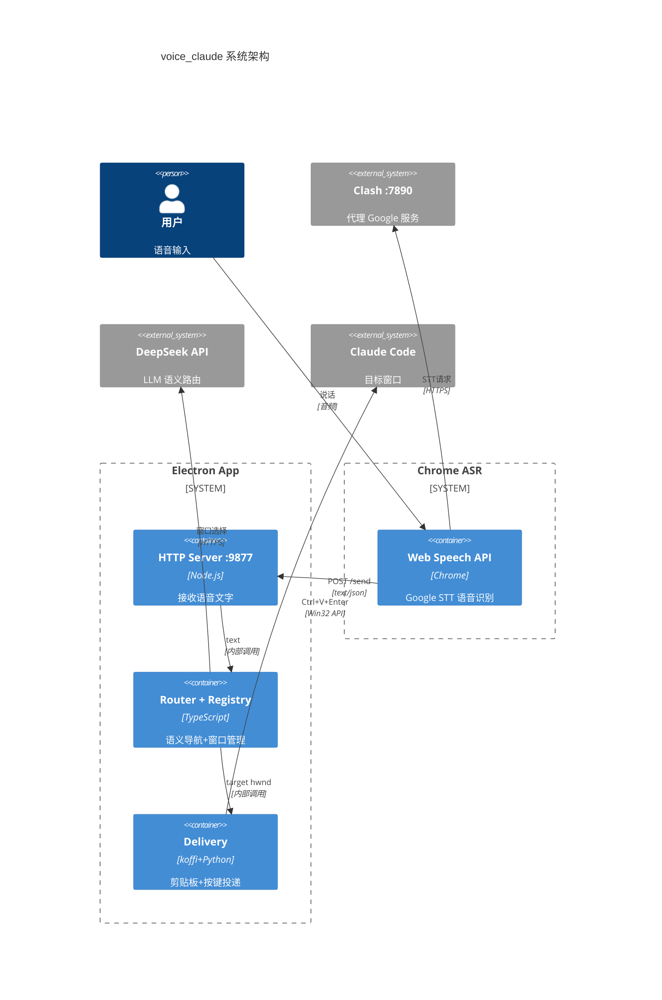
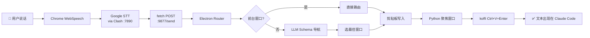
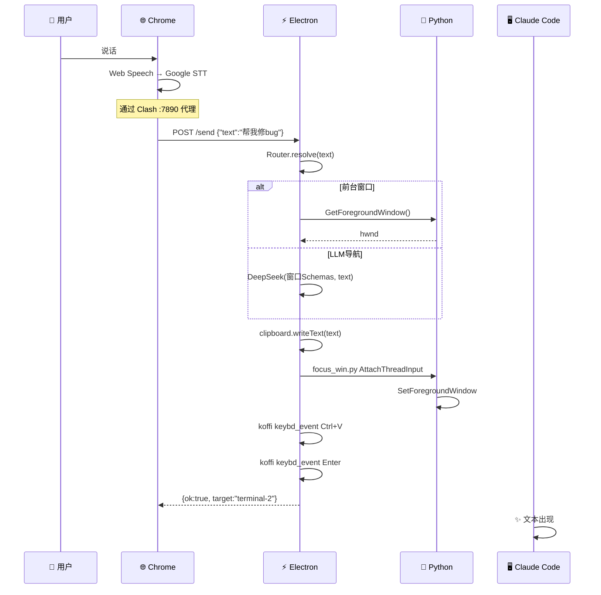
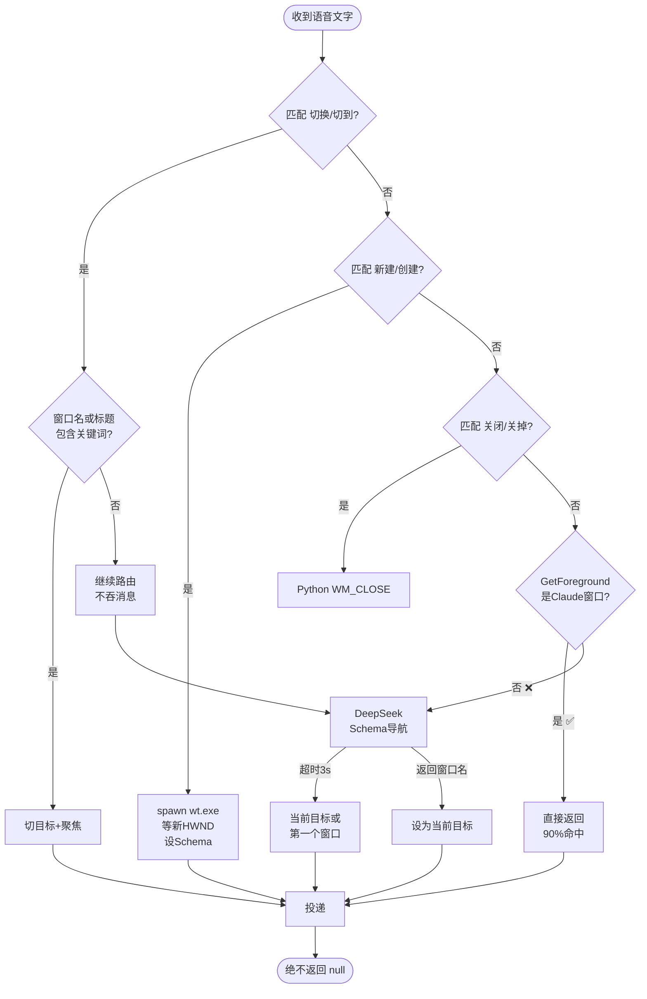
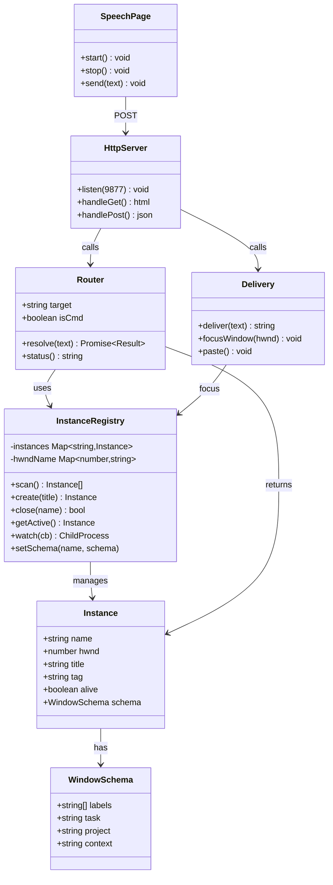
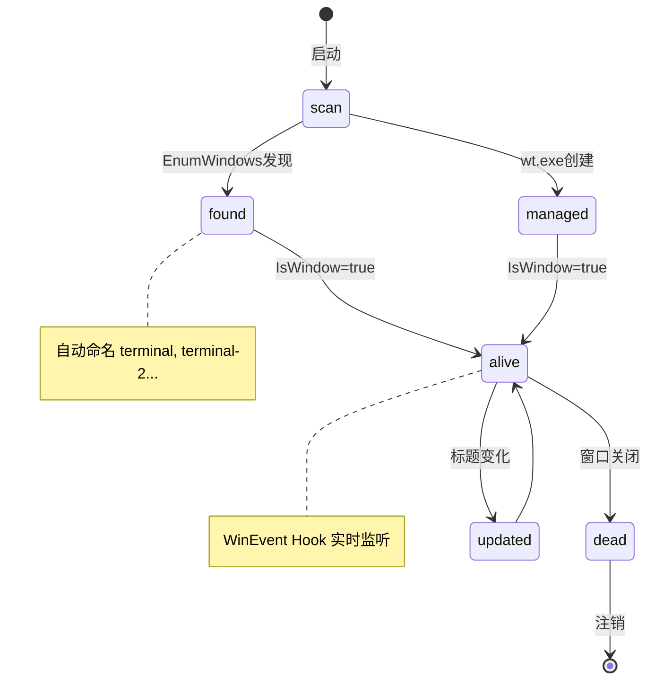

# voice_claude 架构文档

> 语音 → Claude Code · Electron + Chrome ASR + Python Win32 桥接

## 系统架构 (C4 Container)



## 总览



## 分层架构

```
▼ 表示层 (Presentation)
├── speech.html          ← Web Speech API 语音识别 UI
├── status.html          ← Electron 托盘状态面板
└── renderer.html        ← (备用) webview 容器

▼ 应用层 (Application)
├── src/main.ts          ← 应用入口: HTTP服务 + IPC + 生命周期
├── src/preload.ts       ← Electron 安全桥接
└── src/config.ts        ← 配置加载

▼ 领域层 (Domain)
├── src/instance/
│   ├── registry.ts      ← 实例注册表: 窗口发现/创建/销毁/监听
│   └── router.ts        ← 语义路由器: LLM导航 + 命令匹配
└── src/asr/
    └── doubao.ts        ← 豆包 ASR (v3协议, 鉴权通, 待调试)

▼ 基础设施层 (Infrastructure)
├── src/win32/win32.ts   ← Win32 PowerShell 桥接
├── find_win.py          ← ctypes EnumWindows 窗口发现
├── focus_win.py         ← AttachThreadInput 窗口聚焦
├── kill_win.py          ← WM_CLOSE 窗口关闭
└── watch_win.py         ← WinEvent Hook 实时窗口监听
```

## 核心数据流 (时序图)



## Router 决策树



## 核心数据流

```
用户说话
    │
    ▼
Chrome Web Speech API (Google STT via Clash :7890)
    │ text
    ▼
fetch POST http://127.0.0.1:9877/send
    │ {text: "帮我修bug"}
    ▼
Electron HTTP Server (src/main.ts)
    │
    ├── 1. deliver(text)
    │       │
    │       ├── Router.resolve(text)
    │       │   ├── 前台优先: GetForegroundWindow
    │       │   ├── 命令匹配: "切换到XX" → 切目标
    │       │   └── LLM导航: DeepSeek 语义匹配窗口Schema
    │       │       → 返回 Instance {name, hwnd}
    │       │
    │       ├── 2. clipboard.writeText(text)
    │       ├── 3. focus_win.py (AttachThreadInput)
    │       └── 4. koffi keybd_event Ctrl+V+Enter
    │
    └── HTTP Response: {ok:true, target:"terminal-2"}
```

## 组件详解

### 1. 语音采集 (speech.html)

| 项目 | 说明 |
|------|------|
| 引擎 | Chrome Web Speech API (Google STT) |
| 模式 | continuous=true, interimResults=true |
| 去重 | 1.5s 防抖 + lastSent 缓存 |
| 通信 | fetch POST → localhost:9877/send |
| 代理 | Clash :7890 (Chrome 启动参数) |

### 2. 实例管理 (InstanceRegistry)

```
Registry
├── scan()        → Python ctypes EnumWindows
├── create()      → spawn wt.exe + diff 检测新 HWND
├── close()       → Python PostMessage WM_CLOSE
├── watch()       → Python WinEvent Hook 后台进程
├── getActive()   → Python GetForegroundWindow
└── setSchema()   → 更新窗口标签/任务/项目
```

**Schema 结构:**
```typescript
interface WindowSchema {
  labels: string[];    // 标签: ["后端","bug"]
  task: string;        // 任务: "修复认证bug"
  project: string;     // 项目: "voice_claude"
  context: string;     // 上下文: "正在重构pipeline"
}
```

## 组件关系 (类图)



## 实例生命周期 (状态机)



### 3. 语义路由 (Router)

```
优先级:
① 前台窗口 (GetForegroundWindow)     ← 你在哪就发到哪
② 语音命令 "切换到XX"                ← 匹配窗口名/标题/Schema
③ LLM Schema 导航 (DeepSeek)         ← 语义匹配最相关窗口
④ 默认目标                            ← 第一个窗口
⑤ 绝不空 - 无窗口贴前台
```

### 4. 投递链路

```
clipboard.writeText(text)          ← Electron API 写剪贴板
focus_win.py AttachThreadInput     ← Python ctypes 绕过焦点限制
keybd_event Ctrl+V+Enter           ← koffi Win32 模拟按键
```

## 文件清单

```
voice_claude/
├── package.json            # Electron + TypeScript 依赖
├── tsconfig.json           # TS 编译配置
├── ARCHITECTURE.md         # 本文档
│
├── src/
│   ├── main.ts             # 入口: HTTP服务(9877) + 投递管线
│   ├── preload.ts           # Electron IPC 桥接
│   ├── config.ts            # ~/.voice_claude.json 配置
│   ├── instance/
│   │   ├── registry.ts      # 窗口生命周期管理
│   │   └── router.ts        # LLM 语义导航路由器
│   ├── asr/
│   │   └── doubao.ts        # 豆包 ASR v3 (待调试)
│   └── win32/
│       └── win32.ts         # PowerShell Win32 桥接
│
├── speech.html              # Chrome ASR 页面
├── status.html              # Electron 托盘面板
├── renderer.html            # (备用) webview 容器
│
├── find_win.py              # Python: ctypes EnumWindows
├── focus_win.py             # Python: AttachThreadInput 聚焦
├── kill_win.py              # Python: WM_CLOSE 关闭窗口
└── watch_win.py             # Python: WinEvent Hook 实时监听
```

## 启动流程

```
npm start
  │
  ├── tsc 编译 TypeScript
  ├── electron . 启动
  │   ├── 单实例锁
  │   ├── HTTP Server :9877
  │   ├── InstanceRegistry.scan() 发现 5-6 个 Claude 窗口
  │   ├── watch_win.py 启动 WinEvent Hook
  │   ├── Router 初始化 (target=第一个窗口)
  │   ├── 托盘图标
  │   └── exec chrome --app=http://127.0.0.1:9877
  │       ├── Chrome 启动 (代理: :7890, 绕过: localhost)
  │       ├── speech.html 加载
  │       │   ├── fetch /status → 显示 "→ terminal (5个)"
  │       │   └── 等待用户点击 "开始监听"
  │       └── 用户说话 → Web Speech → POST /send → 投递
  └── 退出时: watcher.kill()
```

## 系统要求

| 依赖 | 版本 | 用途 |
|------|------|------|
| Node.js | ≥24 | Electron 运行 |
| TypeScript | ≥5.5 | 编译 |
| Python | 3.11+ (autoclaw) | Win32 桥接 |
| Chrome | 任意 | Web Speech ASR |
| Clash | :7890 | 代理 Google STT |

npm 依赖: `electron`, `typescript`, `koffi`
Python 依赖: 无 (仅标准库 ctypes)

## 配置

`~/.voice_claude.json` (自动生成):

```json
{
  "pipeline": { "enhance": true, "cooldownSec": 3 },
  "routing": { "strategy": "llm", "defaultTarget": "chat" },
  "llm": { "apiKey": "sk-...", "model": "deepseek-chat" }
}
```

## 分支结构

```
master          ← Electron + TypeScript (当前)
python-backend  ← Python 消息队列管道 (37文件, 完整实现)
electron        ← 已合并到 master
```

python-backend 包含: pipeline/ instance/ asr/ delivery/ window/ workflow/ LLM Router / Agent 增强 / 消息队列

---

# 设计不足与优化方向

## 一、当前不足

### P0 — 阻塞性问题

| # | 问题 | 根因 | 影响 |
|---|------|------|------|
| 1 | **依赖 Chrome 外部进程** | Electron Chromium 无法通过 Clash 使用 Web Speech | 必须开 Chrome 窗口, 体感割裂 |
| 2 | **STT 质量不可控** | Google 免费 ASR 中文差, 无法离线 | "切换"→"切换", "refactor"→"refer" |
| 3 | **聚焦不稳定** | Windows 安全策略限制后台进程抢焦点 | 有时窗口不跳到前台 |
| 4 | **无豆包备用** | v3 协议已通, 音频格式未调完 | ASR 无降级方案 |

### P1 — 体验问题

| # | 问题 | 说明 |
|---|------|------|
| 5 | Schema 未持久化 | 窗口标签/任务重启丢失, LLM 导航退化 |
| 6 | 路由不可见 | 用户不知道当前目标是什么窗口 |
| 7 | 无热词/自定义词表 | Google ASR 不支持, 专业术语识别差 |
| 8 | 单点依赖 LLM | DeepSeek 挂了路由退化为随机 |

### P2 — 架构问题

| # | 问题 | 说明 |
|---|------|------|
| 9 | TypeScript/Python 混合 | 两种语言, 两个运行时, 调试复杂 |
| 10 | HTTP 单点 | 9877 端口崩了全链路断 |
| 11 | 无测试 | 零自动化测试, 全靠手动 |
| 12 | 无打包/分发 | npm start 必须手动, 无 installer |

## 二、优化方向

### 1. ASR 层 (P0)

```
当前: Chrome Web Speech (Google STT)
目标: [豆包 ASR 主] + [Chrome Web Speech 备]

路径:
├── 豆包 v3 协议已通, 仅需 pcm 格式微调
├── electron 内置 MediaRecorder → PCM → doubao.ts
└── 失败回落 Chrome Web Speech
```

### 2. 聚焦层 (P0)

```
当前: Python AttachThreadInput (偶发失败)
改进: 
├── 重试机制: 失败后 500ms 重试 3 次
├── 备选方案: Alt+Tab + 窗口匹配
└── 长方案: 纯 koffi 替代 Python
```

### 3. Schema 持久化 (P1)

```
Schema 存到 ~/.voice_claude_windows.json
启动时恢复, 窗口复用上次 Schema
LLM 导航精度随使用增强
```

### 4. 全 TypeScript 化 (P2)

```
Python 脚本 → koffi 原生调用
- find_win.py → koffi EnumWindows (需修复回调)
- focus_win.py → koffi AttachThreadInput
- watch_win.py → koffi SetWinEventHook (需消息循环)
收益: 单运行时, 单语言, 调试友好
```

### 5. 打包分发 (P2)

```
electron-builder → portable .exe
内含: Electron + Node.js + Python embedded
一键启动, 无安装依赖
```

### 6. 可观测性 (P1)

```
├── /metrics 端点: 请求数/延迟/错误率
├── 结构化日志: JSON 格式 + 级别
├── 托盘状态: 实时显示目标窗口+统计
└── 告警: 连续 N 次投递失败 → 系统通知
```

## 三、拓展可能

| 方向 | 说明 | 优先级 |
|------|------|--------|
| **多 ASR 后端** | 热切换 Google/豆包/Vosk, ASRBackend 接口 | P1 |
| **离线 ASR** | Vosk 本地模型, 零网络依赖 | P2 |
| **多人协作** | 多人同时语音→不同实例, 声纹识别 | P3 |
| **语音 TTS 反馈** | "已发送到 terminal-2" | P3 |
| **对话历史** | 投递历史回溯, 撤销重发 | P2 |
| **窗口管理 UI** | 可视化窗口列表+拖拽路由 | P2 |
| **API 化** | REST API 供外部系统调用 | P2 |
| **跨平台** | macOS/Linux 支持 | P3 |

---

## 设计原则

1. **分层解耦**: 表示/应用/领域/基础设施 四层, 上层不依赖下层实现
2. **语言边界最小化**: Python 仅做 Win32 API 桥接, 逻辑在 TS
3. **绝不为空**: 路由找不到窗口 → 贴前台, 永不丢消息
4. **渐进增强**: Schema 可选, LLM 可降级, ASR 可切换
5. **单一入口**: npm start 一键启动全部服务

---

> 最后更新: 2026-06-27
> 版本: v1.0
