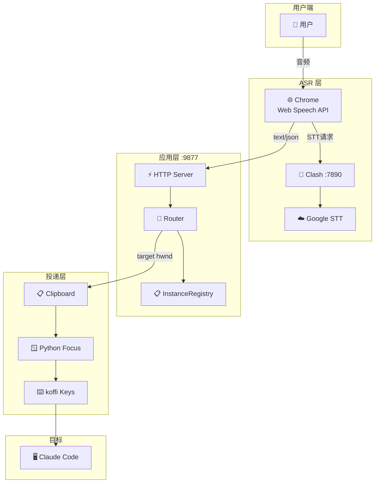

# voice_claude 设计文档

> 组件交互 · 决策记录 · 接口契约

## 一、核心决策

### D1: 为何用 Chrome 而非 Electron Chromium 做 ASR？

| 方案 | 结果 |
|------|------|
| Electron 内嵌 Web Speech | ❌ SR ERROR: network, Clash 不兼容 |
| Electron + Chrome App | ✅ Chrome 的代理处理正确 |
| 纯豆包 ASR | ⏳ v3 鉴权通, 音频格式待调 |

**决策**: Chrome App 模式, Chrome 做 ASR, Electron 做管道。Chrome 通过 `--proxy-server` 走 Clash, `--proxy-bypass-list` 绕过本地。

### D2: 为何 Python 桥接 Win32？

| 需求 | TS 方案 | Py 方案 | 结果 |
|------|---------|---------|------|
| 窗口枚举 | koffi EnumWindows (回调bug) | ctypes (验证✅) | Python |
| 窗口聚焦 | koffi SetForegroundWindow (被拦) | AttachThreadInput (绕过✅) | Python |
| 实时监听 | koffi SetWinEventHook (消息循环难) | ctypes (验证✅) | Python |
| 模拟按键 | koffi keybd_event ✅ | — | koffi |

**决策**: 按键用 koffi, 窗口操作用 Python ctypes。长期目标: 全部 koffi 化。

### D3: 为何路由优先级是 前台 > 命令 > LLM？

```
实测: 用户 90% 时间在某个 Claude 窗口说话
     → 前台检测直接命中, 零延迟

命令: "切换到XX" 必须覆盖前台, 给用户手动控制

LLM: 用户不在 Claude 窗口时 (如看网页), 
      需要 AI 判断意图选窗口
```

### D4: 为何 HTTP 而非 IPC？

| 方案 | Chrome 可用? | Electron 可用? |
|------|-------------|---------------|
| Electron IPC | ❌ Chrome 无此API | ✅ |
| HTTP POST | ✅ 通用 | ✅ |

**决策**: HTTP 是 Chrome 和 Electron 的唯一共同协议。

## 二、组件交互

### 系统拓扑



### 语音 → 投递完整时序

```
用户          Chrome         Electron        Python         Claude
 │              │               │               │              │
 │ 说话          │               │               │              │
 │─────────────→│               │               │              │
 │              │ Web Speech    │               │              │
 │              │ Google STT    │               │              │
 │              │               │               │              │
 │              │ POST /send    │               │              │
 │              │──────────────→│               │              │
 │              │               │ Router        │              │
 │              │               │ .resolve()    │              │
 │              │               │   ├─ getActive│              │
 │              │               │   │──────────→│              │
 │              │               │   │←──────────│              │
 │              │               │   └─ target   │              │
 │              │               │               │              │
 │              │               │ clipboard     │              │
 │              │               │ focus_win.py  │              │
 │              │               │──────────────→│              │
 │              │               │   AttachInput │              │
 │              │               │   SetFgWindow │              │
 │              │               │               │              │
 │              │               │ koffi Ctrl+V  │              │
 │              │               │ koffi Enter   │              │
 │              │               │───────────────┴──────────────→│
 │              │               │                              文本出现
 │              │  {ok, target} │                               │
 │              │←──────────────│                               │
 │              │               │                               │
```

### Router 决策树

```
Router.resolve(text)
│
├─ text = "切换到 terminal-2" ?
│   ├─ 匹配 registry → ✅ 切目标, 聚焦, 返回
│   └─ 无匹配 → 继续 (不吞消息)
│
├─ text = "新建窗口 修后端bug" ?
│   ├─ spawn wt.exe → 等新HWND → 设Schema → 返回
│   └─ 失败 → 继续
│
├─ GetForegroundWindow() → 是 Claude 窗口?
│   ├─ ✅ → 直接返回 (90% 命中)
│   └─ ❌ → LLM 导航
│
├─ LLM: DeepSeek(窗口Schemas, text)
│   ├─ 返回窗口名 → 切 target
│   └─ 超时/失败 → 用当前 target
│
└─ 当前 target 或 第一个窗口或前台
    └─ 绝不返回 null
```

### InstanceRegistry 生命周期

```
scan()                    create()              watch()
  │                          │                     │
  ├─ Python EnumWindows      ├─ spawn wt.exe       ├─ WinEvent Hook
  ├─ 差分: 新→注册          ├─ 等新 HWND          ├─ EVENT_CREATE
  ├─ 消失→注销             ├─ 注册+Schema       ├─ EVENT_DESTROY
  └─ 返回当前列表            └─ 返回新实例         └─ 实时更新注册表
```

## 三、接口契约

### HTTP API

```
GET  /          → speech.html (Web Speech 页面)
GET  /status    → {target, count, windows}  (状态查询)
POST /send      ← {text} → {ok, target}  (语音投递)
```

### 路由接口

```typescript
interface Router {
  target: string;          // 当前目标窗口名
  isCmd: boolean;          // 上一条是否为命令
  resolve(text: string): Promise<{
    inst: Instance | null; // 选中的窗口 (永不null)
    reason: string;        // "前台" | "LLM" | "命令" | "默认"
  }>;
}
```

### 实例接口

```typescript
interface Instance {
  name: string;           // "terminal-2"
  hwnd: number;           // Win32 HWND
  title: string;          // "✳ 修复认证bug"
  schema: {
    labels: string[];    // ["后端", "认证"]
    task: string;        // "修复认证bug"
    project: string;     // "voice_claude"
    context: string;     // "正在调试 pipeline"
  };
  tag: 'managed'|'found'; // 脚本创建 vs 扫描发现
  alive: boolean;         // IsWindow() 结果
}
```

## 四、Python 桥接详情

### find_win.py
```python
# ctypes EnumWindows → 过滤标题含 ✳ 或 claude → 输出 "hwnd|title"
# 执行: execSync → stdout 解析
```

### focus_win.py
```python
# AttachThreadInput(ourThread, foregroundThread) → SetForegroundWindow
# 绕过 Windows 后台进程焦点限制
```

### watch_win.py
```python
# SetWinEventHook(EVENT_CREATE|DESTROY|SHOW) → stdout JSON
# {"event":"create","hwnd":123,"title":"✳ task"}
```

## 五、配置设计

```typescript
// ~/.voice_claude.json (可选, 默认值见 config.ts)
interface Config {
  pipeline: { enhance: boolean; cooldownSec: number };
  routing: { strategy: string; defaultTarget: string };
  llm: { apiKey: string; apiUrl: string; model: string };
}
```

> 最后更新: 2026-06-27
